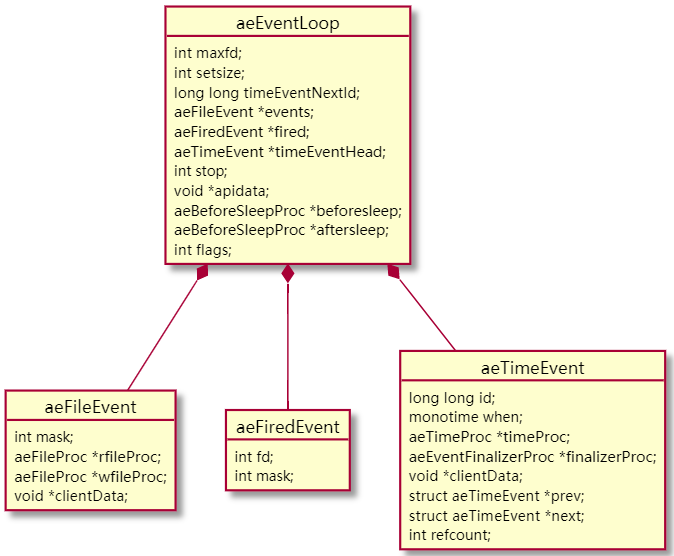
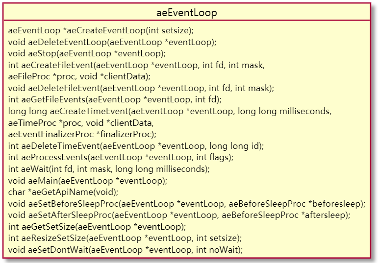
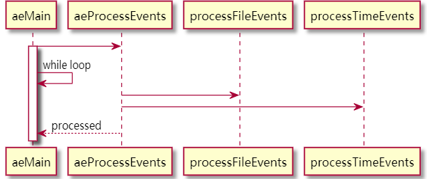
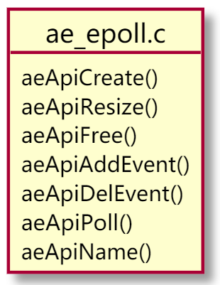

# REDIS AE_EVENT LOOP

## File `ae.h`

### Loop Event
*  `aeEventLoop`

    

* `aeBeforeSleepProc` => before & after hook

### Basic Event

* `aeFileEvent` => `aeFileProc` => read & write

* `aeTimeEvent` => `aeTimeEvent` & `aeFinalizerProc`

* `aeFiredEvent`


### Methods:


* Init:

    ```c
        int main(int argc, char **argv) {
            ...
            aeMain()
            ...
        }
    ```

* Entry:

    ```c
    void aeMain(aeEventLoop *eventLoop) {
        eventLoop->stop = 0;
        while (!eventLoop->stop) {
            aeProcessEvents(eventLoop, AE_ALL_EVENTS|
                                    AE_CALL_BEFORE_SLEEP|
                                    AE_CALL_AFTER_SLEEP);
        }
    }
    ```

* Seq:

    


* ApiPoll()

    ```c
    static int aeApiPoll(aeEventLoop *eventLoop, struct timeval *tvp) {
        aeApiState *state = eventLoop->apidata;
        int retval, numevents = 0;

        retval = epoll_wait(state->epfd,state->events,eventLoop->setsize,
                tvp ? (tvp->tv_sec*1000 + tvp->tv_usec/1000) : -1);
        if (retval > 0) {
            int j;

            numevents = retval;
            for (j = 0; j < numevents; j++) {
                int mask = 0;
                struct epoll_event *e = state->events+j;

                if (e->events & EPOLLIN) mask |= AE_READABLE;
                if (e->events & EPOLLOUT) mask |= AE_WRITABLE;
                if (e->events & EPOLLERR) mask |= AE_WRITABLE|AE_READABLE;
                if (e->events & EPOLLHUP) mask |= AE_WRITABLE|AE_READABLE;
                eventLoop->fired[j].fd = e->data.fd;
                eventLoop->fired[j].mask = mask;
            }
        }
        return numevents;
    }
    ```

* fired[]

    ```c
    fe->rfileProc(eventLoop,fd,fe->clientData,mask);
    fe->wfileProc(eventLoop,fd,fe->clientData,mask);
    ```

## File: `ae_epoll.c`

### Methods:




* `aeApiCreate()`

* `aeApiResize()`

* `aeApiFree()`

* `aeApiAddEvent()`

* `aeApiDelEvent()`

* `aeApiPoll()`

* `aeApiName()`

